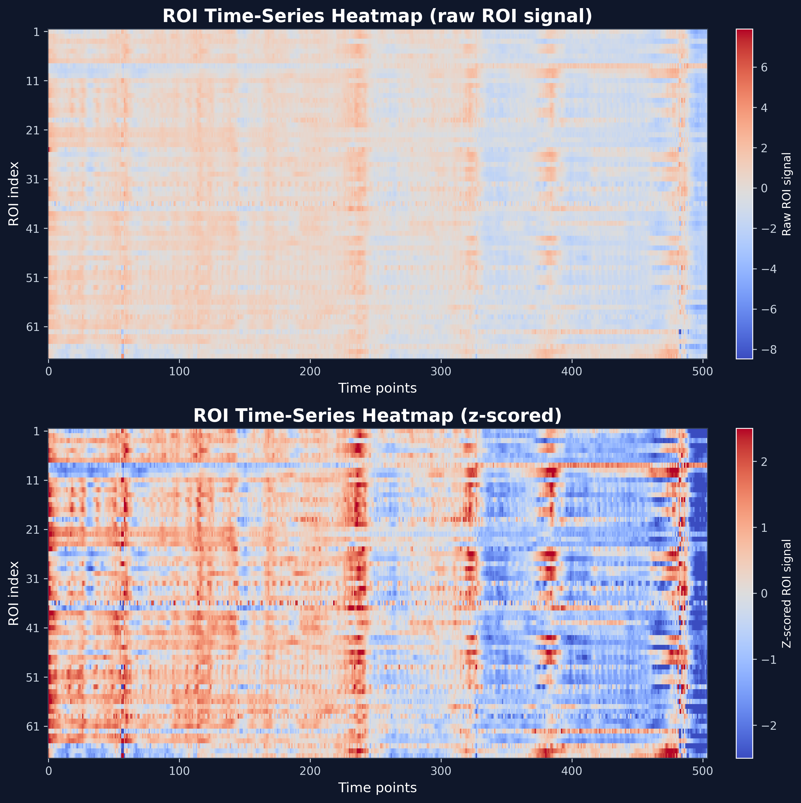
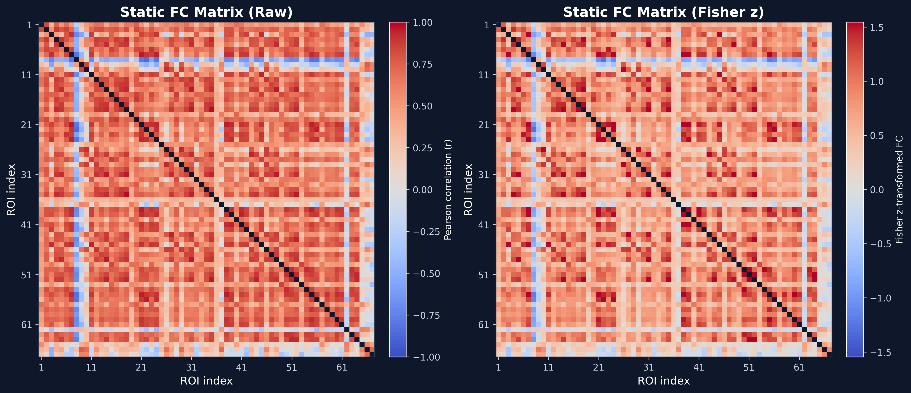

# Computationally Reproducible FC/dFC Workflow for Psychedelic Resting-State fMRI

#### Author: Yu-kan Fan (范育康） 

#### Institution: National Taiwan University

---

This repository develops a computationally reproducible workflow for static functional connectivity (FC) and dynamic functional connectivity (dFC) analysis of resting-state fMRI data from the PsiConnect dataset. At the current stage, the project focuses on workflow construction and pilot-run validation, not group-level inference about psychedelic-related effects.

The long-term goal is to compare static FC and dFC features to evaluate whether dynamic connectivity measures provide complementary information beyond traditional static connectivity analyses.

**Final course presentation slides are available in `doc/final_presentation.pdf`.**

## Scope

Here, **reproducible** refers to computational reproducibility:

```text
same derivatives + same code + same parameters → same outputs
```

The current repository does not yet establish external replication, generalizability to other datasets, or group-level psychedelic-related effects.


---

## Research Questions

Current workflow-focused questions:
- Can we build a documented and computationally reproducible FC/dFC workflow for the PsiConnect fMRIPrep derivatives?
- Can the workflow generate ROI time series, static FC matrices, and sliding-window dFC summaries from one pilot run?
- After scaling up, can FC/dFC features be compared across sessions or psychedelic-related conditions?

---

# Dataset

The analysis uses an open neuroimaging dataset from **OpenNeuro**.

Dataset: PsiConnect  
Accession: ds006110  
Source: https://openneuro.org/datasets/ds006110  

This project focuses only on the resting-state fMRI derivatives from the PsiConnect dataset.

The full dataset is **not included in this repository** because neuroimaging files are large. Users should access the original dataset through OpenNeuro and DataLad.

---

# Dataset Availability

Full fMRIPrep derivatives were verified in the local DataLad file tree. The dataset includes resting-state preprocessed BOLD images and corresponding confound regressors, including MNI152NLin2009cAsym-space outputs:

```text
*_task-rest_*space-MNI152NLin2009cAsym_desc-preproc_bold.nii.gz
*_task-rest_*desc-confounds_timeseries.tsv
*_task-rest_*space-MNI152NLin2009cAsym_desc-brain_mask.nii.gz
```

This confirms that the dataset can support resting-state functional connectivity and dynamic functional connectivity analyses, pending further quality control and selective download/readability checks for git-annexed files.

---

# Current Project Status

Completed so far:

- Inspected fMRIPrep derivatives and generated a resting-state file index.
- Matched resting-state BOLD images, confounds files, and brain masks across runs.
- Verified 127 runs with matched BOLD/confounds/mask files.
- Processed one full pilot run.
- Generated pilot ROI time series, static FC, and sliding-window dFC outputs.

Confirmed resting-state fMRIPrep derivatives:

| File type | Count |
|---|---:|
| MNI-space preprocessed resting-state BOLD | 127 |
| Resting-state confounds TSV | 127 |
| MNI-space brain masks | 127 |
| All task-rest derivative files | 5877 |

Session-level coverage:

| Session | Rest MNI BOLD | Confounds TSV |
|---|---:|---:|
| ses-01 | 65 | 65 |
| ses-02 | 62 | 62 |

Summary:

```text
BOLD/confounds count match: YES
BOLD/mask count match: YES
FC/dFC pipeline feasibility: YES
```

A resting-state file index has also been generated:

```text
outputs/file_index/rest_file_index.csv
```

This file index contains subject/session-level paths for BOLD images, confounds files, and brain masks. It will serve as the input table for QC, ROI time-series extraction, static FC, and dynamic FC analyses.

---

# Analysis Pipeline

<div align="center">
  
</div>

---

The analysis workflow consists of the following steps:

1. Dataset inspection and BIDS/fMRIPrep structure verification
2. Resting-state file index generation
3. BOLD/confounds/mask quality control
4. ROI parcellation using a preliminary grid atlas, with planned replacement by a standard atlas such as Schaefer 100/200
5. ROI time-series extraction
6. Static functional connectivity estimation
7. Sliding-window dynamic functional connectivity estimation
8. Extraction of dynamic network features
9. Comparison between static and dynamic connectivity measures

---
## Interim Pilot Results

To show what the workflow yields, I applied the current pipeline to one pilot resting-state run:

```text
sub-PC001 / ses-01 / task-rest / run-1
```

These results are intended as **workflow-validation outputs**, not as evidence for psychedelic-related effects or group-level findings.

### Pilot output summary

| Output | Result |
|---|---:|
| ROI time-series matrix | 504 × 67 |
| Static FC matrix | 67 × 67 |
| Sliding-window FC matrices | 45 |
| Mean edge dFC variability | 0.361 |
| Max edge dFC variability | 0.653 |

A machine-readable summary of the pilot run is available at `outputs/pilot_summary.csv`.

### ROI Time-Series Extraction

<div align="center">
  <p><b>ROI Time-series Heatmap</b></p>
  
</div>

**Figure:** ROI time-series heatmaps from the pilot run. The upper panel shows raw ROI signals, and the lower panel shows z-scored ROI signals. Rows correspond to ROIs and columns correspond to time points.

### Static Functional Connectivity

<div align="center">
  <p><b>Static FC Matrix</b></p>
  
</div>

**Figure:** Static FC matrices from the pilot run. The left panel shows raw Pearson correlation values, and the right panel shows Fisher z-transformed FC values. The diagonal is masked for visualization.

### Static FC Descriptive Checks

<div align="center">
  <p><b>Static FC Descriptive Checks</b></p>
  
</div>

**Figure:** Static FC sanity checks, including the distribution of pairwise FC values and mean connectivity strength by ROI. These plots are not interpreted as ROI-level neurobiological findings.

### Dynamic Functional Connectivity

Dynamic FC was estimated using a sliding-window approach. The pilot run was divided into 45 overlapping windows. For each window, a Fisher z-transformed FC matrix was computed.


**Figure:** Mean Fisher z-transformed FC across sliding windows. The shaded region indicates ±1 SD across edges within each window.


**Figure:** Edge-wise dFC variability matrix. Brighter values indicate ROI-to-ROI connections with greater temporal fluctuation across windows.


**Figure:** Window-to-window FC pattern similarity matrix. Higher values indicate more similar whole-matrix FC configurations between windows.

### Interpretation

These interim results show that the workflow can generate ROI time series, static FC, and sliding-window dFC outputs from fMRIPrep derivatives. At this stage, the outputs validate the computational workflow only. They do not support claims about psychedelic-related effects, session differences, or group-level neural mechanisms.

## Usage

### 1. Check dataset availability

```bash
python src/check_dataset.py --data-dir /path/to/ds006110
```

### 2. Build resting-state file index

```bash
python src/build_file_index.py --data-dir /path/to/ds006110
```

This generates:

```text
outputs/file_index/rest_file_index.csv
```

## Reproducing Pilot Figures

The pilot figures were generated using:

```text
pilot_figure_generation.ipynb
```

When running the notebook in Google Colab, upload the following derived pilot outputs when prompted:

1. `sub-PC001_ses-01_task-rest_run-1_roi_timeseries_z.csv`
2. `sub-PC001_ses-01_task-rest_run-1_static_fc.csv`
3. `sub-PC001_ses-01_task-rest_run-1_static_fc_fisher_z.csv`
4. `fc_dfc.zip`

The `fc_dfc.zip` file should contain 45 Fisher z-transformed sliding-window FC matrices matching:

```text
sub-PC001_ses-01_task-rest_run-1_window-*_fc_fisher_z.csv
```

## Current Limitations

- One pilot run has been processed so far.
- The current atlas is a preliminary grid-based atlas.
- Motion and nuisance control are not finalized.
- No group-level inference has been performed.
- The exact experimental meaning of `ses-01` and `ses-02` still needs to be confirmed from dataset documentation or associated publications.
- Reproducibility here refers to computational reproducibility only, not external replication.

## Next Steps

- Scale the workflow to all 127 matched resting-state runs.
- Replace the preliminary grid atlas with a standard atlas such as Schaefer 100/200.
- Strengthen motion and nuisance regression.
- Link imaging runs with session-level or condition-level metadata.
- Compare FC/dFC features across sessions or conditions after metadata linkage.

## License

This repository is released under the MIT License.

The license applies only to the code and documentation in this repository. The original PsiConnect dataset is governed by its own license and terms on OpenNeuro.
