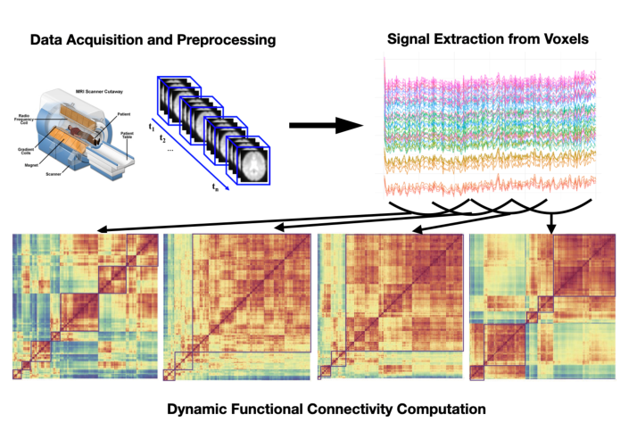
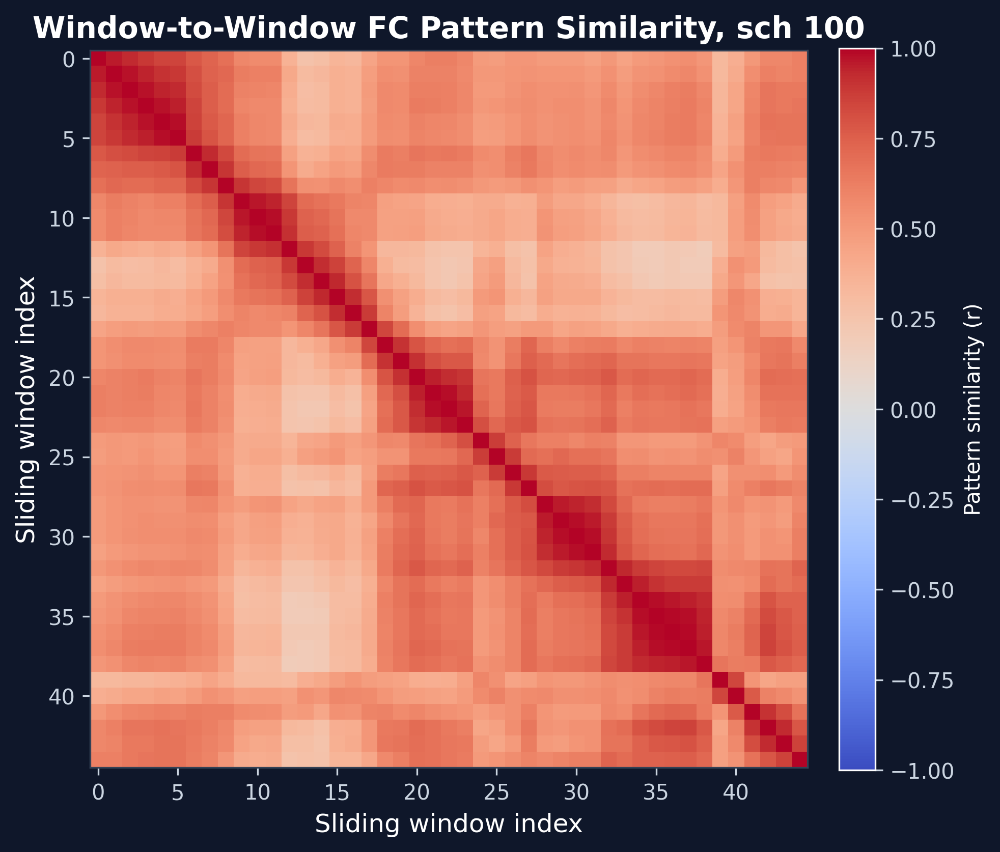
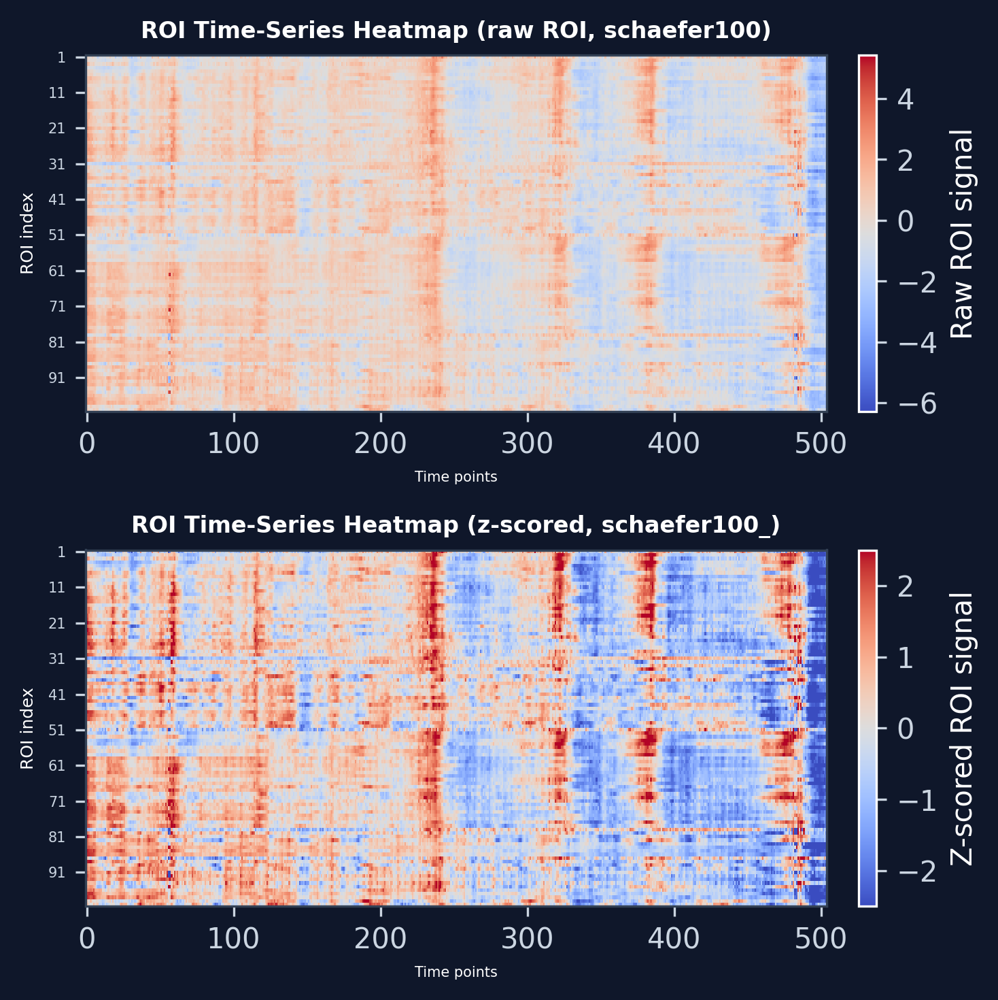
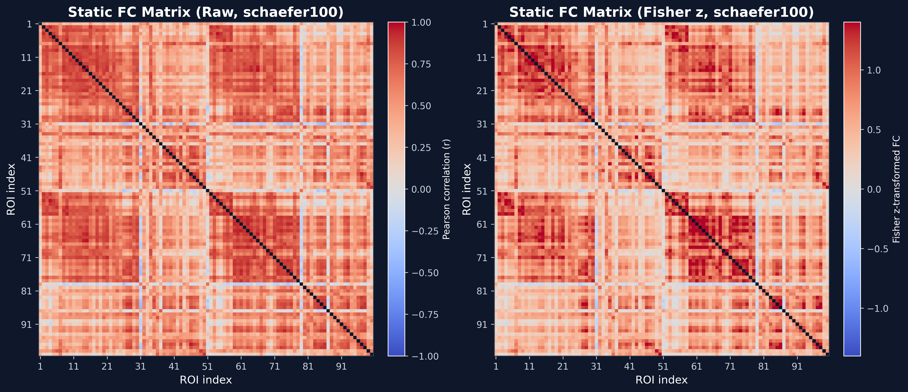
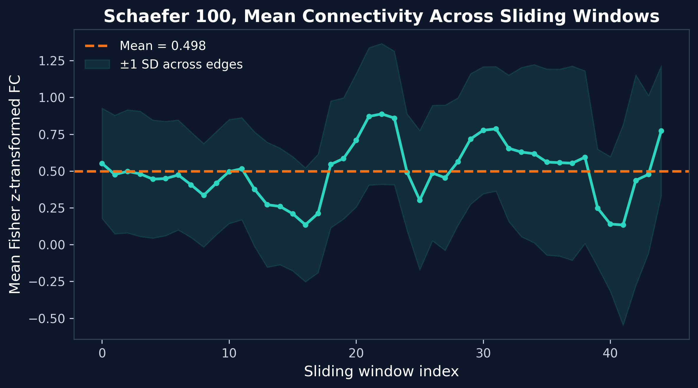
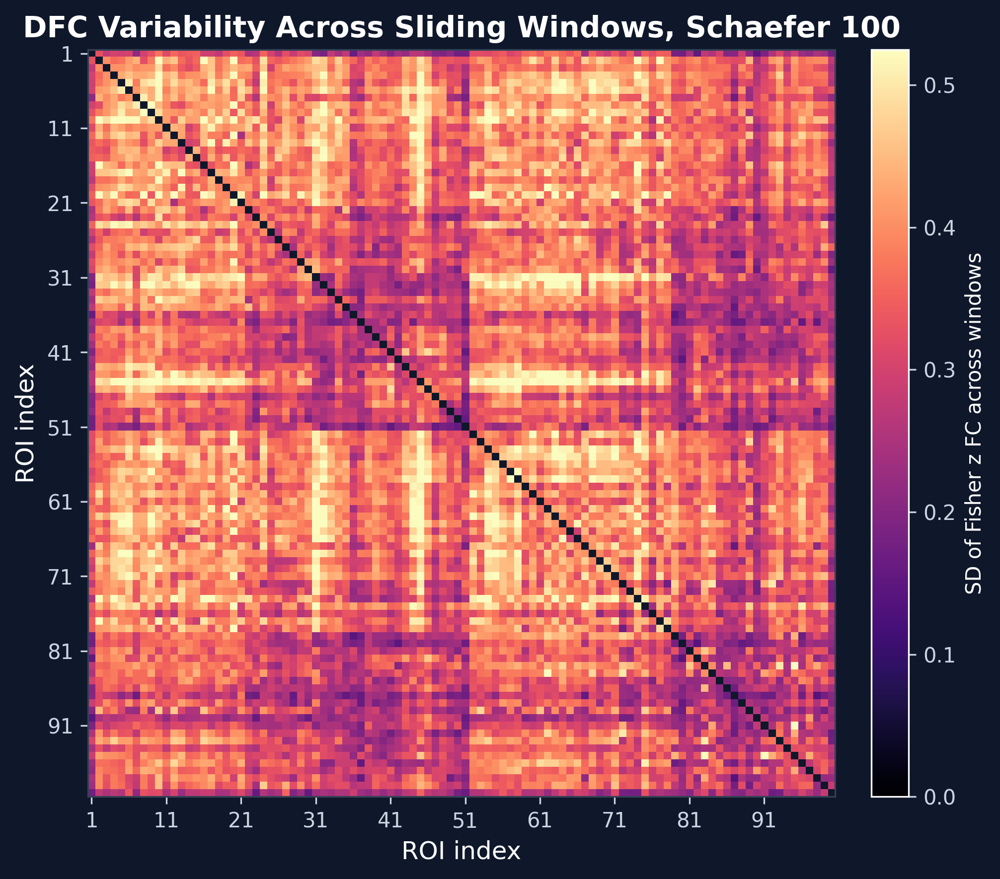

# Reproducible dynamic Functional connectivity (dFC) Workflow for task-free Resting-State fMRI

#### Author: Yu-kan Fan (范育康)
#### Institution: National Taiwan University

---

## 1. What This Project Does

This project builds a **reproducible pipeline for dynamic functional connectivity (dFC)** analysis in fMRI data.

It is especially designed for **task-free and long-duration experiments**, where brain activity evolves naturally over time rather than being driven by external tasks.

This makes it suitable for studying:

- Resting-state brain activity  
- Drug-induced altered states  
- Sensory deprivation  

## 2. Why Dynamics Matter

In task-free conditions, brain connectivity is usually not static.

Traditional **static functional connectivity (sFC)** averages the entire scan into a **single matrix**, which **removes all temporal information**.

Instead, **dynamic functional connectivity (dFC)** captures how connectivity patterns **change over time**.

### Sliding-window methods

By dividing the time series into smaller windows,
we can compute connectivity within each window
and track how it evolves.

<div align="center">
  
</div>

### Empirical example of my dataset

The figure below is the funal result.

It shows that connectivity patterns are **not constant**.

<div align="center">
  <p><b>Window-to-Window FC Similarity</b></p>
  
</div>

Static analysis would average all this temporal structure away.


---

## 2. The Solution: A Reproducible Pipeline

I built a **workflow** that goes from 

`fMRIPrep derivatives → ROI extraction → static FC → sliding-window dFC`

### Dataset:

PsiConnect (OpenNeuro `ds006110`) — a **psychedelic** neuroimaging study. This dataset is ideal for dFC analysis because altered consciousness states exhibit rich temporal dynamics.

### Current focus:

Workflow validation on one pilot run 'sub001', 

2 different pipelines.


<div align="center">
  
</div>


---

## 3. Pipeline 1 — Validation with a Preliminary Grid Atlas (6/15)

I first validated the pipeline using a **preliminary grid atlas (67 ROIs)** on one pilot run:

```text
sub-PC001 / ses-01 / task-rest / run-1
```

> This atlas is purely geometric. Its goal is **code validation**, not neurobiological interpretation.

| Output | Result |
|---|---:|
| ROI time-series matrix | 504 × 67 |
| Static FC matrix | 67 × 67 |
| Unique FC edges | 2211 |
| Sliding-window FC matrices | 45 |
| Mean edge dFC variability | 0.361 |

<div align="center">
  <p><b>Example result: Grid Atlas — Static FC & dFC Variability Matrix</b></p>
   
   
   <p><b>(see old_README.md)</b></p>

</div>

**Result:** The pipeline successfully produced ROI time series, static FC, and 45 dynamic FC windows. The code works.

### but! Grid atlas only cuts the brain by geometry. </b></p> 

<div align="center">
<p><b>So...</b></p>
</div>

---

## 4. Upgrade: Pipeline 2 with "Schaefer 100" ⭐ (6/29, 6/30)

To make results **biologically meaningful**, I upgraded to the **Schaefer 100 atlas**, which is a functionally-defined atlas based on real brain networks (e.g., Default Mode Network).

> **Why Schaefer 100, not 400?** Finer parcellation (400) demands much heavier noise regression. Schaefer 100 is the best balance between **capturing network dynamics** and **controlling noise** at the pilot stage.

| Metric | Grid atlas | Schaefer 100 |
|---|---:|---:|
| ROIs | 67 | 100 |
| Unique edges | 2211 | 4950 |
| Static mean FC | 0.496 | 0.488 |
| Static FC SD | 0.334 | 0.257 |
| Mean dFC variability | 0.361 | 0.355 |
| Max dFC variability | 0.653 | 0.689 |

## 4.1 ROI Time Series

<div align="center">
  <p><b>Schaefer 100 — ROI Time-Series Heatmap</b></p>
  
</div>

**Vertical bands = many ROIs fluctuating together.** This typically reflects **global signal, head motion, or physiological noise** — not neural evidence. It's a **QC signal** telling me denoising needs strengthening.


## 4.2 Static FC — Grid vs Schaefer 100

<div align="center">
  <p><b>grid atlas - Static FC Matrix</b></p>
  
</div>

<div align="center">
  <p><b>Schaefer 100 — Static FC Matrix</b></p>
  
</div>

### **Key difference:** Schaefer 100 shows more **structured, network-organized** layout. 

## 4.3 Dynamic FC

<div align="center">
  <p><b>Schaefer 100 — dFC Mean Connectivity Trajectory</b></p>
  
</div>

### Mean connectivity is **not flat** — temporal structure exists for dFC to capture.

<div align="center">
  <p><b>Grid Atlas — dFC Mean Connectivity Trajectory</b></p>
  
</div>

<div align="center">
  <p><b>Schaefer 100 — dFC Variability Matrix</b></p>
  
</div>

### Brighter edges = higher temporal fluctuation. 
With Schaefer 100, these can be **mapped onto large-scale networks** — impossible with grid atlas.

---

## 5. Summary: One Framework, Two Depths

| | Pipeline 1 (Grid) | Pipeline 2 (Schaefer 100) |
|---|---|---|
| Purpose | **Code validation + Data QC** | Feature extraction |
| Atlas | Geometric grid | Functional networks |
| Interpretability | Low | Network-level |
| **Best for** | **Newcomers & Data validation** | **Researchers building dFC studies** |

- **Pipeline 1** is your **testing ground** — validate your fMRIPrep derivatives work end-to-end, check if your data can run through the full dFC pipeline, even if you're new to neuroimaging code.
- **Pipeline 2** adds Schaefer 100 and preliminary denoising to extract **neurobiologically meaningful** dynamic features — ready for real research.

This open, plug-and-play toolkit is ready to scale to the remaining 127 PsiConnect runs, and can lower the technical barrier for newcomers to dFC analysis — including my own future **sensory-deprivation research**.
