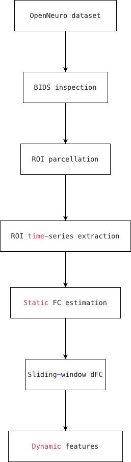

# Dynamic Functional Connectivity in Psychedelic-Induced Altered States of Consciousness

Author: Fan Yu-kang  
Institution: National Taiwan University

This repository develops a reproducible workflow for inspecting and analyzing resting-state fMRI data from the PsiConnect dataset. The project focuses on how psychedelic-associated altered states of consciousness may influence the temporal organization of large-scale brain networks.

The main goal is to compare **static functional connectivity (FC)** and **dynamic functional connectivity (dFC)** to determine whether dynamic connectivity measures provide additional information beyond traditional static connectivity analyses.

This repository is part of a course project focused on **open neuroscience workflows**, including dataset inspection, reproducible pipelines, and open-source neuroimaging analysis.

---

# Research Questions

This project focuses on three main questions:

- How do psilocybin-associated altered states of consciousness alter resting-state brain connectivity?
- Do brain networks exhibit different **temporal dynamics** across experimental sessions?
- Does **dynamic functional connectivity (dFC)** provide complementary information beyond static FC?

---

# Dataset

The analysis uses an open neuroimaging dataset from **OpenNeuro**.

Dataset: PsiConnect  
Accession: ds006110  
Source: https://openneuro.org/datasets/ds006110  

Key features of the dataset include:

- Approximately 65 participants
- Two sessions
- Psilocybin-related experimental design
- Multimodal recordings, including MRI and EEG
- Tasks including resting-state, meditation, music listening, and movie watching

This project focuses on **resting-state fMRI data** to analyze intrinsic brain network dynamics.

The full dataset is **not included in this repository** because neuroimaging files are large. Users should access the original dataset through OpenNeuro and DataLad.

---

# Dataset Availability Update

Full fMRIPrep derivatives were verified in the local DataLad file tree. The dataset includes resting-state preprocessed BOLD images and corresponding confound regressors, including MNI152NLin2009cAsym-space outputs:

```text
*_task-rest_*space-MNI152NLin2009cAsym_desc-preproc_bold.nii.gz
*_task-rest_*desc-confounds_timeseries.tsv
*_task-rest_*space-MNI152NLin2009cAsym_desc-brain_mask.nii.gz
```

This confirms that the dataset can support resting-state functional connectivity and dynamic functional connectivity analyses, pending further quality control and selective download/readability checks for git-annexed files.

---

# Current Project Status

The current version of this repository has completed the initial dataset inspection and file-index generation stages.

Confirmed resting-state fMRIPrep derivatives:

| File type | Count |
|---|---:|
| MNI-space preprocessed resting-state BOLD | 127 |
| Resting-state confounds TSV | 127 |
| MNI-space brain masks | 127 |
| All task-rest derivative files | 5877 |

Session-level coverage:

| Session | Rest MNI BOLD | Confounds TSV |
|---|---:|---:|
| ses-01 | 65 | 65 |
| ses-02 | 62 | 62 |

Summary:

```text
BOLD/confounds count match: YES
BOLD/mask count match: YES
FC/dFC pipeline feasibility: YES
```

A resting-state file index has also been generated:

```text
outputs/file_index/rest_file_index.csv
```

This file index contains subject/session-level paths for BOLD images, confounds files, and brain masks. It will serve as the input table for future QC, ROI time-series extraction, static FC, and dynamic FC analyses.

---

# Analysis Pipeline



The planned analysis pipeline consists of the following steps:

1. Dataset inspection and BIDS/fMRIPrep structure verification
2. Resting-state file index generation
3. BOLD/confounds/mask quality control
4. ROI parcellation using a standard brain atlas
5. ROI time-series extraction
6. Static functional connectivity estimation
7. Sliding-window dynamic functional connectivity estimation
8. Extraction of dynamic network features
9. Comparison between static and dynamic connectivity measures

---

# Repository Structure

```text
altered-states-dfc/
├── README.md
├── LICENSE
├── requirements.txt
├── PROJECT_LOG.md
├── analysispipeline.png
├── docs/
│   ├── dataset_status.md
│   └── analysis_plan.md
├── src/
│   ├── check_dataset.py
│   └── build_file_index.py
└── outputs/
    └── file_index/
        └── rest_file_index.csv
```

---

# Usage

## 1. Check dataset availability

Run the dataset inspection script:

```bash
python src/check_dataset.py --data-dir /Users/macbookair/ds006110
```

This script checks the availability of resting-state fMRIPrep outputs, including:

- MNI-space preprocessed BOLD files
- Confounds TSV files
- MNI-space brain masks
- Session-level coverage

## 2. Build resting-state file index

Run the file-index generation script:

```bash
python src/build_file_index.py --data-dir /Users/macbookair/ds006110
```

This script generates:

```text
outputs/file_index/rest_file_index.csv
```

The file index includes:

- subject
- session
- task
- run
- MNI-space BOLD path
- confounds path
- brain mask path
- relative paths
- file existence indicators
- readiness for analysis

---

# Current Limitations

- The exact experimental meaning of `ses-01` and `ses-02` still needs to be confirmed from the dataset documentation or associated publication.
- The current repository has completed dataset inspection and file indexing, but ROI time-series extraction has not yet been implemented.
- Static FC and sliding-window dFC analyses are planned but not yet completed.
- Large neuroimaging files are not stored in this GitHub repository.
- Further quality control is required to verify BOLD readability, image dimensions, timepoints, TR, confounds alignment, and motion quality.

---

# Next Steps

The immediate next steps are:

1. Build a BOLD metadata quality-control table.
2. Verify BOLD image readability and metadata.
3. Check whether BOLD timepoints match confounds rows.
4. Confirm the experimental meaning of `ses-01` and `ses-02`.
5. Test ROI time-series extraction for a single subject/session.
6. Compute a single-subject static FC matrix.
7. Implement a simple sliding-window dFC demonstration.

---

# License

This repository is released under the MIT License.

The license applies only to the code and documentation in this repository. The original PsiConnect dataset is governed by its own license and terms on OpenNeuro.
