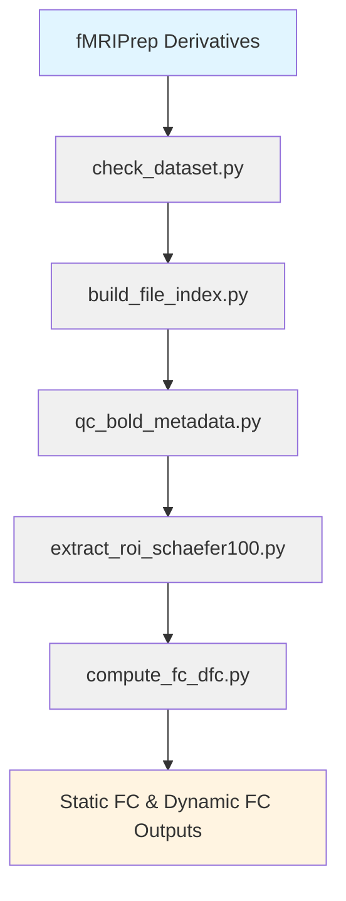

## Pipeline Execution Order

The scripts should be executed in the following order:

```bash
# Step 0: Check dataset availability
python src/check_dataset.py --data-dir /path/to/ds006110

# Step 1: Build resting-state file index
python src/build_file_index.py \
  --data-dir /path/to/ds006110 \
  --output outputs/file_index/rest_file_index.csv

# Step 2: QC metadata (readability + alignment)
python src/qc_bold_metadata.py \
  --file-index outputs/file_index/rest_file_index.csv \
  --output outputs/qc/rest_bold_qc.csv

# Step 3: Create a ready-for-ROI CSV
python -c "
import pandas as pd
df = pd.read_csv('outputs/qc/rest_bold_qc.csv')
ready = df[df['ready_for_roi_extraction'] == True]
ready.to_csv('outputs/qc/rest_ready_for_roi.csv', index=False)
print(f'Ready runs: {len(ready)}')
"

# Step 4: Extract Schaefer 100 ROI time series
python src/extract_roi_schaefer100.py \
  --ready-index outputs/qc/rest_ready_for_roi.csv \
  --output-dir outputs/roi_timeseries_schaefer100 \
  --atlas-mode schaefer

# Step 5: Compute static FC and sliding-window dFC
python src/compute_fc_dfc.py \
  --timeseries-summary outputs/roi_timeseries_schaefer100/roi_timeseries_summary.csv \
  --output-dir outputs/fc_dfc_schaefer100 \
  --window-size 60 \
  --step-size 10
```

---

## 1. `check_dataset.py` — Dataset Availability Check

**Purpose:**  
Quickly verify the completeness and structure of fMRIPrep resting-state derivatives.

**Usage:**
```bash
python src/check_dataset.py --data-dir /path/to/ds006110
```

**Outputs:**
- Terminal summary of file counts
- Verification of BOLD/confounds/mask alignment

**When to use:**
- First-time dataset inspection
- Confirming dataset structure before building the file index

---

## 2. `build_file_index.py` — File Index Generation

**Purpose:**  
Build a structured CSV index of all resting-state BOLD files, confounds, and brain masks.

**Usage:**
```bash
python src/build_file_index.py \
  --data-dir /path/to/ds006110 \
  --output outputs/file_index/rest_file_index.csv
```

**Outputs:**
- `outputs/file_index/rest_file_index.csv`

**Key columns:**
- `subject`, `session`, `task`, `run`
- `bold_mni_path`, `confounds_path`, `brain_mask_path`
- `ready_for_analysis` (boolean flag)

**When to use:**
- After confirming dataset availability
- Before batch processing multiple runs

---

## 3. `qc_bold_metadata.py` — BOLD Metadata Quality Control

**Purpose:**  
Perform deep quality control on BOLD files, including readability checks, shape verification, and temporal alignment with confounds.

**Usage:**
```bash
python src/qc_bold_metadata.py \
  --file-index outputs/file_index/rest_file_index.csv \
  --output outputs/qc/rest_bold_qc.csv
```

**Outputs:**
- `outputs/qc/rest_bold_qc.csv`

**Key QC metrics:**
- `bold_readable`, `bold_shape`, `bold_n_volumes`, `bold_tr`
- `confounds_readable`, `confounds_n_rows`, `fd_mean`, `fd_max`
- `bold_confounds_aligned` (timepoint alignment check)
- `ready_for_roi_extraction` (boolean flag)

**When to use:**
- After building file index
- Before ROI extraction to ensure data quality

---

## 4. `extract_roi_schaefer100.py` — ROI Time Series Extraction

**Purpose:**  
Extract ROI-level time series from preprocessed BOLD images using the Schaefer 100 atlas.

**Usage:**
```bash
python src/extract_roi_schaefer100.py \
  --ready-index outputs/qc/rest_ready_for_roi.csv \
  --output-dir outputs/roi_timeseries_schaefer100 \
  --atlas-mode schaefer
```

**Outputs (per run):**
- `{base}_schaefer100_atlas.nii.gz` (resampled atlas for reference/visual QC)
- `{base}_schaefer100_roi_timeseries.csv` (raw ROI signals)
- `{base}_schaefer100_roi_timeseries_z.csv` (z-scored ROI signals)
- `{base}_schaefer100_roi_labels.csv` (ROI label mapping)

**Summary file:**
- `outputs/roi_timeseries_schaefer100/roi_timeseries_summary.csv`

**When to use:**
- After QC confirms `ready_for_roi_extraction == True`
- When using Schaefer 100 atlas for network-level analysis

---

## 5. `compute_fc_dfc.py` — FC and dFC Computation

**Purpose:**  
Compute static functional connectivity (sFC) and sliding-window dynamic functional connectivity (dFC) from ROI time series.

**Usage:**
```bash
python src/compute_fc_dfc.py \
  --timeseries-summary outputs/roi_timeseries_schaefer100/roi_timeseries_summary.csv \
  --output-dir outputs/fc_dfc_schaefer100 \
  --window-size 60 \
  --step-size 10
```

**Outputs (per run):**

### Static FC
- `{base}_schaefer100_static_fc.csv` (Pearson r)
- `{base}_schaefer100_static_fc_fisher_z.csv` (Fisher z-transformed)

### Dynamic FC
- `{base}_schaefer100_window-000_fc_fisher_z.csv` (window 0)
- `{base}_schaefer100_window-001_fc_fisher_z.csv` (window 1)
- ... (45 windows total under default parameters)

### Summary files
- `{base}_schaefer100_window_summary.csv` (per-window statistics)
- `{base}_schaefer100_edge_dfc_summary.csv` (edge-wise temporal variability)
- `outputs/fc_dfc_schaefer100/fc_dfc_summary.csv` (overall summary across runs)

**When to use:**
- After ROI extraction is complete
- To generate connectivity matrices for downstream analysis

---

## Pipeline Overview (Visualization)



---
